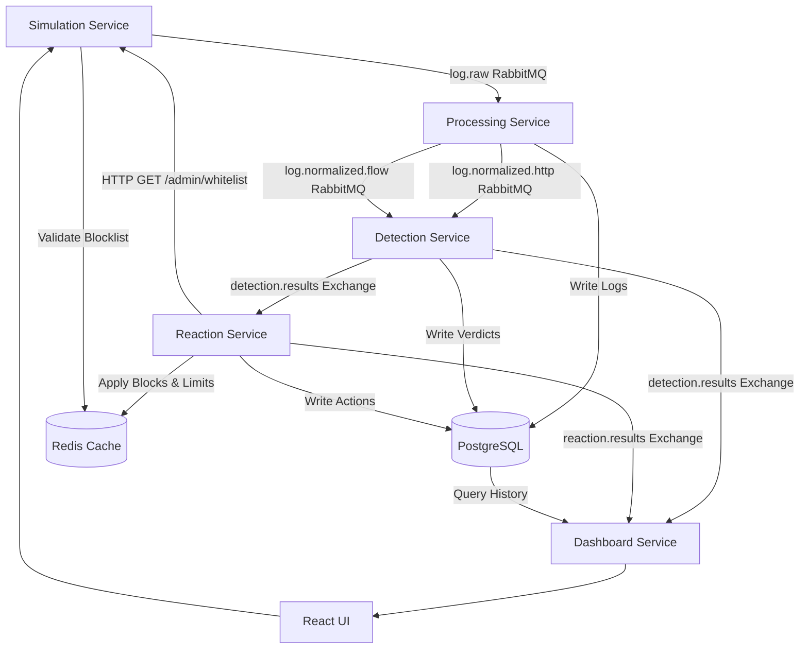

# System Architecture

The log-analyzer system is built on a distributed, event-driven architecture consisting of **5 core components**. All components communicate asynchronously through **RabbitMQ** to ensure high throughput, fault tolerance, and loose coupling, utilizing **PostgreSQL** for persistence and **Redis** for state caching.

---

## 1. Microservice Architecture Detail

The system is structured as five decoupled microservices. Below is a detailed breakdown of their architectural layout, internal models, concurrency models, and scaling behaviors.

```
┌────────────────────────────────────────────────────────────────────────┐
│                          SIMULATION SERVICE                            │
│                                                                        │
│  ┌─────────────────────────┐               ┌────────────────────────┐  │
│  │   Poisson HTTP Gen      │               │   Flow Trace Replay    │  │
│  └────────────┬────────────┘               └───────────┬────────────┘  │
│               │                                        │               │
│               └───────────────────┬────────────────────┘               │
│                                   ▼                                    │
│                     [ Publisher (asyncio / aio-pika) ]                 │
└───────────────────────────────────┬────────────────────────────────────┘
                                    │
                                    │ (RabbitMQ Raw Stream: log.raw)
                                    ▼
┌────────────────────────────────────────────────────────────────────────┐
│                          PROCESSING SERVICE                            │
│                                                                        │
│                    [ Subscriber (Spring AMQP / Hikari) ]               │
│                                   │                                    │
│                                   ▼                                    │
│                    ┌───────────────────────────────┐                   │
│                    │   CLF & Flow Normalization    │                   │
│                    └──────────────┬────────────────┘                   │
│                                   ├────────────────────────┐           │
│                                   ▼ (PostgreSQL Write)     ▼           │
│                            ┌─────────────┐          ┌─────────────┐    │
│                            │  Database   │          │  Publisher  │    │
│                            └─────────────┘          └──────┬──────┘    │
└────────────────────────────────────────────────────────────┼───────────┘
                                                             │
                                   ┌─────────────────────────┴─────────────────────────┐
                                   │ (HTTP Track: log.normalized.http)                 │ (Flow Track: log.normalized.flow)
                                   ▼                                                   ▼
┌────────────────────────────────────────────────────────┐   ┌────────────────────────────────────────────────────────┐
│                   DETECTION SERVICE                    │   │                   DETECTION SERVICE                    │
│                     (HTTP Track)                       │   │                      (Flow Track)                      │
│                                                        │   │                                                        │
│   ┌────────────────────────────────────────────────┐   │   │   ┌────────────────────────────────────────────────┐   │
│   │         FastAPI Scheduler & Jobs               │   │   │   │         FastAPI Consumer / Model Store         │   │
│   ├────────────────────────────────────────────────┤   │   │   ├────────────────────────────────────────────────┤   │
│   │ • Statistical Ensemble (EMA, Z-Score, IQR, SB) │   │   │   │ • ML Classifiers (XGBoost DDoS / Brute Force)  │   │
│   │ • Web Attack Layer (Regex Signature + XGBoost) │   │   │   │ • 43-Feature Parity Alignment                  │   │
│   └───────────────────────┬────────────────────────┘   │   │   └───────────────────────┬────────────────────────┘   │
│                           ▼ (PostgreSQL Write)         │   │                           ▼ (PostgreSQL Write)         │
│                     [ Publisher (aio-pika) ]           │   │                     [ Publisher (aio-pika) ]           │
└───────────────────────────┬────────────────────────────┘   └───────────────────────────┬────────────────────────────┘
                            │                                                            │
                            └───────────────────────────┬────────────────────────────────┘
                                                        │ (detection.results Exchange)
                                                        ▼
┌────────────────────────────────────────────────────────────────────────┐
│                           REACTION SERVICE                             │
│                                                                        │
│                  [ Subscriber (Spring AMQP / JPA / Redis) ]            │
│                                   │                                    │
│                                   ▼                                    │
│                  ┌─────────────────────────────────┐                   │
│                  │   Escalating Attempt Counter    │                   │
│                  │  (Lua sliding rate-limit/block) │                   │
│                  └────────────────┬────────────────┘                   │
│                                   ├────────────────────────┐           │
│                                   ▼ (Redis Block updates)  ▼           │
│                            ┌─────────────┐          ┌─────────────┐    │
│                            │ Alerts/Logs │          │  Publisher  │    │
│                            └─────────────┘          └──────┬──────┘    │
└────────────────────────────────────────────────────────────┼───────────┘
                                                             │
                                                             │ (reaction.results Exchange)
                                                             ▼
┌────────────────────────────────────────────────────────────────────────┐
│                           DASHBOARD SERVICE                            │
│                                                                        │
│   ┌────────────────────────────────────────────────────────────────┐   │
│   │                       Dashboard Backend                        │   │
│   │                (Spring Boot REST API + SseEmitter)             │   │
│   └───────────────────────────────┬────────────────────────────────┘   │
│                                   ▼ (SSE Multiplexed Stream /api/stream)│
│   ┌────────────────────────────────────────────────────────────────┐   │
│   │                       Dashboard Frontend                       │   │
│   │                       (Vite & React 19 UI)                     │   │
│   └────────────────────────────────────────────────────────────────┘   │
└────────────────────────────────────────────────────────────────────────┘
```



### 1.1 Ingestion / Simulation Service
*   **Role**: Dedicated script and mock generator running on FastAPI/Uvicorn.
*   **Architecture**: Follows an asynchronous task loop pattern powered by `asyncio`. It publishes raw log lines (CLF formatted logs and JSON flow arrays) using `aio-pika` to prevent blocking the generator thread.
*   **Concurrency**: Implements a non-blocking asynchronous event loop, running baseline Poisson-based normal traffic generators and flow replayers concurrently.
*   **Auto-Scaling Mechanism**: Exposes a scaling mechanism (`infrastructure/scaler.py`) that polls dynamic load requirements from Redis and orchestrates Gunicorn/Uvicorn child worker counts on the fly using signal traps (`SIGTTIN` to scale up, `SIGTTOU` to scale down). Only one worker holds the Redis scaler lock (`scale:scaler_lock`) at a time.

### 1.2 Processing Service
*   **Role**: Normalization and ingestion entrypoint.
*   **Architecture**: Built using Spring Boot 4.x following a Clean Architecture Controller-Service-Repository layout. Uses Flyway for database migrations.
*   **Concurrency**: The Spring AMQP listener (`RawLogConsumer`) only enqueues incoming messages into a Redis sorted set (`RedisQueueService`, key `raw-log-queue`). A separate poller thread (`LogProcessingPoller`) dequeues batches and dispatches them to a `ThreadPoolTaskExecutor` (core: 4, max: 12, configurable via `LogProcessingProperties`).
*   **Feature Alignment**: Standardizes various incoming logs. For HTTP, it parses headers, methods, and routes. For Flows, it passes through whatever feature keys the incoming record contains (no fixed column count is enforced) and replaces any `NaN` or `Infinity` values with `0.0`. The trained ML models (UC2/UC4) expect 43 specific feature keys.
*   **Hikari Pool Configuration**: Configured with a dedicated `maximum-pool-size: 10` (minimum-idle: 2) to maintain database connection stability under high-rate inserts.

### 1.3 Detection Service
*   **Role**: Algorithmic & ML anomaly classifiers.
*   **Architecture**: Written in Python / FastAPI. It houses the `model_store` which dynamically downloads model binaries (`.pkl` files) from MinIO on startup.
*   **Concurrency & Pipelines**:
    *   **HTTP Analysis Track**: Consumes windowed data from `log.normalized.http` and executes batch statistics (EMA, Z-score, IQR, and Robust Seasonal Baseline V2) scheduled at 60-second bounds. Web attacks (UC3) run through a Regex Signature matching layer followed by a supervised XGBoost classification layer.
    *   **Flow Analysis Track**: Consumes individual flow records in real time from `log.normalized.flow`, running parallel async XGBoost inference processes for DDoS (UC2) and Brute Force (UC4) using a shared 43-feature vector.
*   **Inference Loop**: FastAPI runs under Uvicorn utilizing an `asyncio`-driven client pool for PostgreSQL (`asyncpg`) and Redis (`redis-py`).

### 1.4 Reaction Service
*   **Role**: Defense logic and automated incident response.
*   **Architecture**: Built with Spring Boot 4.x using JPA and Spring AMQP.
*   **Concurrency**: Utilizes a single listener thread per queue to guarantee execution order of reactions for any given IP address.
*   **Sliding Window Rate Limiter**: Inherits from `EscalatingIpReactionService`. Uses Redis-backed Lua scripts (`INCR_WITH_EXPIRE`) to track IP violations over a 10-minute sliding window:
    *   `< 3 violations`: Emits a `RATE_LIMIT` action.
    *   `>= 3 violations`: Escalates the reaction to a complete IP `BLOCK` (temporarily blacklisted in Redis).
*   **Notification Dispatch**: Employs an asynchronous thread pool to dispatch alerts via configured providers (SMTP mail, Resend API, or Discord Webhooks) without slowing down the core event consumption.

### 1.5 Dashboard Backend & Frontend
*   **Role**: Monitoring and manual operator override interface.
*   **Backend Architecture**: Spring Boot backend that consumes RabbitMQ fanout exchanges and maintains a thread-safe registry of `SseEmitter` clients.
*   **SSE Heartbeat**: Broadcasts 15-second heartbeats (`heartbeat` event type) to prevent browser proxy disconnects. Runs database counts on PostgreSQL every 2 seconds to broadcast log throughput metrics (`log_throughput` event type).
*   **Frontend Architecture**: Single Page Application built on Vite 8, React 19, Recharts, and Tailwind CSS. Connects to the SSE endpoint `/api/stream` using native browser `EventSource` to drive real-time graphs and live anomaly tickers.

---

## 2. Queue & Broker Architecture Detail

The asynchronous backbone of the system utilizes **RabbitMQ** to connect all processing, analysis, and response stages.

```
                  ┌───────────────────────┐
                  │  SIMULATION SERVICE   │
                  └───────────┬───────────┘
                              │
                              │ (Publish: log.raw routing key)
                              ▼
                       [ Exchange: amq.direct ]
                              │
                              ├──────────────────────────┐
                              │ (Binding: log.raw)       │ (Binding: log.raw.failed)
                              ▼                          ▼
               ┌───────────────────────┐          ┌───────────────────────┐
               │    Queue: log.raw     │          │ Queue: log.raw.failed │
               └───────────┬───────────┘          └───────────────────────┘
                           │
                           │ (Spring AMQP Consume)
                           ▼
                  ┌───────────────────────┐
                  │  PROCESSING SERVICE   │
                  └─────┬───────────┬─────┘
                        │           │
      (Publish: log.normalized.http)│ (Publish: log.normalized.flow)
                        ▼           ▼
        [ Exchange: amq.direct ]     [ Exchange: amq.direct ]
                        │                    │
                        ▼                    ▼
      ┌───────────────────────────┐    ┌───────────────────────────┐
      │Queue: log.normalized.http │    │Queue: log.normalized.flow │
      └──────────┬────────────────┘    └──────────┬────────────────┘
                 │                                │
                 │ (FastAPI Consume)              │ (FastAPI Consume)
                 ▼                                ▼
                   ┌──────────────────────────┐
                  │    DETECTION SERVICE     │
                  └─────────────┬────────────┘
                                │
                                │ (Publish: fanout)
                                ▼
                   [ Exchange: detection.results ]
                                │
                 ┌──────────────┴──────────────┐
                 │                             │
                 ▼                             ▼
   ┌──────────────────────────┐  ┌──────────────────────────┐
   │ Queue: detection.results │  │ Queue: anonymous.dash.dt │
   │ (Durable, Reaction Serv.)│  │ (Non-durable, Dash Serv.)│
   └─────────────┬────────────┘  └─────────────┬────────────┘
                 │                             │
                 ▼                             ▼
         ┌──────────────┐              ┌──────────────┐
         │ REACTION SRV │              │  DASHBOARD   │
         └──────┬───────┘              └──────┬───────┘
                │                             ▲
                │ (Publish: fanout)           │
                ▼                             │
     [ Exchange: reaction.results ]           │
                │                             │
                └─────────────────────────────┘
                  (Binding to: anonymous.dash.rx)
```

### 2.1 Topologies, Exchanges & Routing Keys
All RabbitMQ exchanges are configured as durable to withstand broker restarts.

1.  **Raw Log Ingestion Channel**:
    *   **Exchange**: `amq.direct` (Default direct exchange)
    *   **Queue Name**: `log.raw` (Durable)
    *   **Routing Key**: `log.raw`
    *   **Purpose**: Simulation service publishes raw line events directly to this entrypoint.
2.  **HTTP Normalized Channel**:
    *   **Exchange**: `amq.direct`
    *   **Queue Name**: `log.normalized.http` (Durable; `x-dead-letter-exchange: log.dlx`, `x-dead-letter-routing-key: log.normalized.http.dlq`)
    *   **Routing Key**: `log.normalized.http`
    *   **Purpose**: Processing service routes parsed HTTP logs to the Detection service. Declared with identical DLX arguments on both the publishing side (log-processing, Java) and the consuming side (log-analysis, Python) so either can declare the queue first without a `406 PRECONDITION_FAILED` argument mismatch.
3.  **Flow Normalized Channel**:
    *   **Exchange**: `amq.direct`
    *   **Queue Name**: `log.normalized.flow` (Durable; `x-dead-letter-exchange: log.dlx`, `x-dead-letter-routing-key: log.normalized.flow.dlq`)
    *   **Routing Key**: `log.normalized.flow`
    *   **Purpose**: Processing service routes sanitized network flows to the Detection service. Same cross-service DLX-argument-matching requirement as above.
4.  **Detection Verdict Channel**:
    *   **Exchange**: `detection.results` (Type: `fanout`)
    *   **Subscribers**:
        *   **Reaction Queue**: `detection.results.reaction` (Durable queue bound to the exchange, manual acknowledgement; `x-dead-letter-exchange=reaction.dlx` / `x-dead-letter-routing-key=detection.results.reaction.dlq`). Action integrity is critical.
        *   **Dashboard Queue**: Temporary anonymous auto-delete queue (e.g. `amq.gen-xxxx`) generated by Spring AMQP per dashboard replica. Discardable on consumer disconnect.
5.  **Reaction Action Channel**:
    *   **Exchange**: `reaction.results` (Type: `fanout`)
    *   **Subscribers**:
        *   **Dashboard Queue**: Temporary anonymous auto-delete queue. Receives IP block or rate-limiting events to refresh live dashboard states.
6.  **Reaction Dead-Letter Channel**:
    *   **Exchange**: `reaction.dlx` (Type: `direct`)
    *   **Queue**: `detection.results.reaction.dlq` (Durable), consumed by `ReactionDeadLetterConsumer` (auto-ack — there is no further retry path from this leaf).
    *   **Purpose**: Catches detection events that Reaction failed to process (e.g. a Postgres or Redis write failure inside the escalation logic) instead of losing them on ack. The consumer extracts the `x-death` reason and writes an audit row to `reaction.dropped_reactions`.

### 2.2 Serialization & Message Payload Schemas
All messages are serialized and transmitted in **JSON UTF-8** format:
-   `log.raw`: `{ "id": "uuid", "source": "HTTP|FLOW", "rawMessage": "...", "receivedAt": "2025-01-01T00:00:00Z", "headers": {} }`
-   `log.normalized.http`: `{ "timestamp": 12345.67, "ip": "1.2.3.4", "method": "GET", "url": "/index", "status": 200, "bytes": 512, "query_string": "", "user_agent": "..." }`
-   `log.normalized.flow`: `{ "timestamp": 12345.67, "source_ip": "1.2.3.4", "dest_ip": "5.6.7.8", "source_port": 443, "dest_port": 8080, "features": { "Flow Bytes/s": 120.0, "Total Fwd Packets": 4.0, ... } }`
-   `detection.results`: `{ "detection_id": "uuid", "uc": "UC2", "ts": "ISO-8601", "verdict": "DDoS", "severity": "HIGH", "source_ip": "1.2.3.4", "dest_ip": "5.6.7.8", "confidence": 0.95 }`
-   `reaction.results`: `{ "reaction_id": "uuid", "action": "BLOCK|RATE_LIMIT", "target": "1.2.3.4", "ttl_seconds": 600, "source_detection_id": "uuid", "ts": "ISO-8601" }`

### 2.3 Ack Modes & Concurrency Configuration
-   **Manual Acknowledgment**:
    -   Used by `log-processing` (for `log.raw`) and `reaction` (for `detection.results.reaction`). Messages are acknowledged only after the respective service has **successfully written the record to PostgreSQL** (and, for `reaction`, the Redis block/rate-limit write inside `ReactionService.handle()`).
    -   If PostgreSQL goes down, the transaction fails, the message is not acknowledged, and RabbitMQ redelivers the message when the channel recovers. `reaction`'s consumer (`DetectionResultConsumer`) explicitly `nack`s without requeue (`basicNack(tag, false, false)`) on a handling failure, which routes the message to `reaction.dlx` → `detection.results.reaction.dlq` rather than redelivering it in a loop — see §2.1.6.
-   **Auto-Ack**:
    -   Used by the `dashboard` SSE queues and `reaction`'s own `ReactionDeadLetterConsumer` (on the DLQ — there's nowhere further to route a message that fails there, so it just logs and acks). Because dashboard updates are purely temporary live visual indicators, dropping a message during a dashboard crash is acceptable (re-connection triggers a fresh bulk REST load from PostgreSQL).

### 2.4 Error Handling & Dual-Path Failure Routing
The `log-processing` service implements two distinct error paths depending on the nature of the failure:

1.  **Transient Processing/Database Failures (DB-backed Retry - `DlqRetryScheduler`)**:
    -   If parsing or persistence fails due to transient database connection issues or transaction rollbacks, the exception is caught.
    -   Instead of losing the message, the raw payload is saved as a `FailedLogEntry` in a Redis list DLQ (key `failed-log-queue`, via `RedisDlqRepository`) with `retry_count = 0`.
    -   A dedicated background scheduler (`DlqRetryScheduler`) polls failed entries, re-processes, and republishes them with a configurable backoff (default: 30000ms) and randomized jitter (default: ±5000ms). Exceeding `max_retries` (default: 3) marks the log as exhausted and persists it to the Postgres `drop_audit` table. If Redis itself is unreachable/full, or that `drop_audit` write also fails (a double fault, with nowhere left to requeue), the entry is logged in full at ERROR and a `logs.dlq.double_fault` metric is incremented so the loss is observable instead of silent.
2.  **Fatal Serialization/Validation Failures (RabbitMQ DLX - `DeadLetterConsumer`)**:
    -   Fatal payload conversion issues or JSON formatting errors in the Spring listener container trigger rejection without requeueing.
    -   These messages are routed through the Dead Letter Exchange (`log.dlx`) to the `log.raw.dlq` queue.
    -   A dedicated `DeadLetterConsumer` consumes the queue using a raw non-converting listener factory (`dlqContainerFactory`) to prevent conversion error loops, parsing the message body and logging it alongside its `x-death` metadata to the `drop_audit` table. If that `drop_audit` write fails, the consumer attempts to deserialize the body back into a `RawLog` and requeue it into the Redis DLQ for a fresh retry cycle (`logs.dlx.requeued_to_dlq` metric) — this is a legitimate cross-pipeline action, not circular, since the message arrived via RabbitMQ's DLX rather than the Redis DLQ. If the body isn't valid `RawLog` JSON, it's logged as unrecoverable (`logs.dlx.unrecoverable` metric).

---

## 3. Shared Infrastructure

The following components provide shared state and data persistence for the core microservices:

*   **PostgreSQL**: Serves as the primary RDBMS for persisting normalized logs, detection results, reaction history, and system audit trails.
*   **Redis**: Provides high-speed distributed caching for the sliding log window, temporary IP blacklists, and ingestion rate-limiting state.
*   **MinIO**: An S3-compatible object store used to manage and version ML model artifacts (.pkl files).

---

## 4. Technology Stack

| Component | Technology | Rationale |
| :--- | :--- | :--- |
| **Ingestion** | Java / Spring Boot | Strong concurrency models and enterprise-grade RabbitMQ integration. |
| **Detection** | Python / FastAPI | Native support for ML libraries (scikit-learn, statsmodels) and high-performance async IO. |
| **Message Broker** | RabbitMQ | Reliable message delivery and flexible routing (fanout exchanges for multi-consumer event streams). |
| **Dashboard Backend** | Java / Spring Boot | REST + SSE (`SseEmitter`) for live UI, JdbcTemplate for PostgreSQL reads. |
| **Frontend** | Vite / React | Dynamic, real-time data visualization with native `EventSource` for SSE. |

