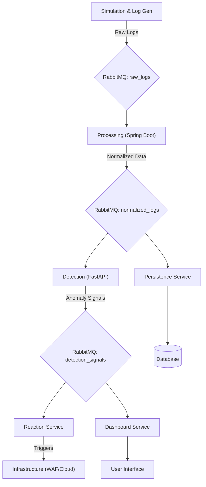

# System Architecture

The log-analyzer system is built on a distributed, event-driven architecture consisting of 5 core microservices and 1 dedicated simulation module. All components communicate asynchronously through **RabbitMQ** to ensure high throughput, fault tolerance, and loose coupling.

---

## 1. Architectural Components

### External / Supporting Modules
*   **Simulation & Log Generation**: A Python-based module (using Faker, Pandas, and numpy) that generates synthetic web traffic and injects anomalous patterns (spikes, DDoS, regressions). It publishes raw logs to the `raw_logs` exchange.

### Core Microservices
1.  **Processing Service (Spring Boot)**: 
    *   **Role**: Entry point for log ingestion.
    *   **Logic**: Normalizes diverse log formats (Apache, Nginx, Custom) into a standard JSON schema, performs initial validation, and prepares features for detection.
2.  **Detection Service (FastAPI)**:
    *   **Role**: Behavioral and statistical analysis.
    *   **Logic**: Runs ML models (Isolation Forest, One-Class SVM) and statistical algorithms (ARIMA, Z-Score). It consumes normalized logs and publishes "Detection Signals."
3.  **Reaction Service**:
    *   **Role**: Intelligence aggregation and orchestration.
    *   **Logic**: Aggregates signals from multiple detectors. If a consensus is reached or a threshold is breached, it triggers automated responses (e.g., blocking an IP via WAF or signaling an Auto-scaler).
4.  **Persistence & Storage Service**:
    *   **Role**: Data integrity and historical context.
    *   **Logic**: Persists normalized logs, heartbeats, and alert records into a centralized database for auditing and dashboard history.
5.  **Dashboard Service**:
    *   **Role**: Human-in-the-loop monitoring.
    *   **Logic**: Provides a real-time UI for visualizing traffic trends, anomaly scores, and reactive status.

---

## 2. Communication & Data Flow

The system utilizes an asynchronous messaging pattern with **RabbitMQ** at the center.

---

## 3. Technology Stack

| Component | Technology | Rationale |
| :--- | :--- | :--- |
| **Ingestion** | Java / Spring Boot | Strong concurrency models and enterprise-grade RabbitMQ integration. |
| **Detection** | Python / FastAPI | Native support for ML libraries (scikit-learn, statsmodels) and high-performance async IO. |
| **Message Broker** | RabbitMQ | Reliable message delivery and flexible routing (Topic/Direct exchanges). |
| **Frontend** | React / Next.js | Dynamic, real-time data visualization. |
