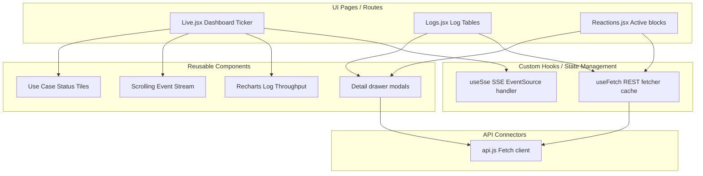

# Dashboard Frontend Architecture

The **Dashboard Frontend** (contained in the `dashboard-fe` directory) is a Single Page Application (SPA) providing real-time log monitoring, alert indicators, and manual mitigation control.

---

## 1. Architectural Pattern: Component-Based Architecture & Hooks

The Dashboard Frontend is designed using React’s **Component-Based Architecture** paired with a **Hooks-driven State Management** approach, isolating UI layouts from event streaming and data fetching logic:

-   **Views/Pages (`pages/`)**: Top-level route entrypoints (e.g. `Live`, `Logs`, `Detections`, `Reactions`, `System`). These manage layout assembly and invoke data hooks.
-   **Reusable Components (`components/`)**: Lightweight, stateless, or presentation-focused UI widgets (e.g. UC tiles, live scroll lists, modal charts, detail drawers) that accept attributes and styles.
-   **Custom Hooks (`hooks/`)**: Encapsulates state-management logic. Includes hooks to connect, buffer, and clean up SSE streams, as well as hooks that coordinate REST fetches with browser lifecycle hooks.
-   **API Clients (`api.js`)**: Isolated data connector layer that exposes functions to call REST endpoints, maintaining decoupling from components.



---

## 2. Directory Structure

```
dashboard-fe/
├── src/
│   ├── components/      # UI components (tiles, streams, charts, detail cards)
│   ├── pages/           # Views (Live, Logs, Detections, Reactions, System, Simulation)
│   ├── hooks/           # Custom React hooks (SSE stream listeners, REST data fetching)
│   ├── api.js           # REST API client configurations
│   ├── index.css        # Tailwind stylesheet
│   └── main.jsx         # App mounting, route setup
├── nginx.conf           # Local Nginx configuration (port 3000)
├── nginx-ssl.conf       # SSL enabled deployment Nginx configuration (ports 80/443)
└── Dockerfile           # Multi-stage production Nginx wrapper
```

---

## 2. Core Views & Components

### 2.1 Live Ticker & Charts (`pages/Live.jsx`)
-   **SSE Connection**: Connects to the `/api/stream` SSE multiplexer using native browser `EventSource` API.
-   **Live Stream Ticker**: Renders an auto-updating scrolling timeline of detection and reaction events. Includes a pause-on-hover feature.
-   **Active Mitigation Strip**: Shows currently blocked IPs with active TTL countdowns.
-   **Throughput Chart**: Renders a rolling 60-second queue throughput chart (HTTP vs. Flow rates) using Recharts.

### 2.2 Logs View (`pages/Logs.jsx`)
-   Offers tabbed log inspection (HTTP access logs vs. network flows) pointing to the dual-track design.
-   Supports server-side pagination, custom route filters, and source IP search.

### 2.3 Mitigation Overrides (`pages/Reactions.jsx`)
-   Displays active rate limits, blocked IPs, and the IP whitelist.
-   **Blocklist card**: Each blocked IP row has a **Lift** checkbox and a **WL** (whitelist) checkbox. Checking "Lift" queues that IP for block removal; checking "WL" adds it to the pending whitelist state.
-   **Whitelist card**: Shows the effective (pending) whitelist. IPs can be added manually via a text input or via the blocklist's "WL" checkbox. Each listed IP has a Remove button. Pending additions are shown in italic until applied.
-   **Apply changes button**: Appears when any pending changes exist. On click it fires exactly two API calls in parallel — `PUT /simulate/admin/whitelist` (replace the entire whitelist, proxied straight through to the Simulation service) and `POST /api/reactions/blocks/lift` (lift all checked IPs, served by the Dashboard service — not Reaction, which only reads the whitelist/block state) — then resets pending state and reloads live data.
-   **Reaction timeline**: Individual "Lift block" buttons per BLOCK row remain for single-IP overrides from the historical view, calling `POST /api/reactions/{id}/lift` (Dashboard service).

---

## 3. Technology Stack & styling

-   **Runtime/Builder**: Vite 8 + React 19.
-   **Styling**: Tailwind CSS (dark mode by default, monospace layouts for IPs, ports, and timestamps).
-   **Graphics**: Recharts.
-   **HTTP Client**: Axios.
