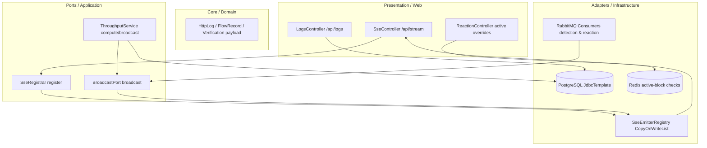

# Dashboard Backend Service Architecture

The **Dashboard Backend** is a Spring Boot service that provides REST APIs and Server-Sent Events (SSE) channels to feed real-time analytics to the user interface.

---

## 1. Architectural Pattern: Clean Architecture / Hexagonal Architecture

The Dashboard Backend service is designed using the **Clean Architecture / Hexagonal Architecture** pattern to separate monitoring delivery mechanisms from database infrastructure:

-   **Domain Layer (`domain/`)**: Declares basic data transfer entities mapping historical records (`HttpLog`, `FlowRecord`, `DetectionVerdict`, `ReactionLog`). Contains zero web-specific context.
-   **Application Layer (`application/`)**: Defines ports and handles monitoring operations. Manages the live SSE subscriber registry (`SseEmitterRegistry`) and calculates active log throughput rates.
-   **Infrastructure Layer (`infrastructure/`)**: Implements database repository connections (using Spring JdbcTemplate for read performance) and maps RabbitMQ listener bindings.
-   **Presentation Layer (`presentation/`)**: Exposes REST endpoints for querying history and mounts the `/api/stream` SSE channel (`SseController`).



---

## 2. Directory Structure

```
dashboard/
├── src/main/java/com/nvh12/dashboard/
│   ├── application/     # SSE registrar, registry, consumer models
│   ├── config/          # CORS configurations, RabbitMQ setup
│   ├── domain/          # Entities (HttpLog, FlowRecord, Detections, Reactions)
│   ├── infrastructure/  # JPA, Spring Data, Prometheus metrics client
│   └── presentation/    # REST APIs, SSE endpoints (SseController.java)
└── Dockerfile           # Multi-stage build target
```

---

## 2. Core Components & Responsibilities

### 2.1 Server-Sent Events (SSE) Registry (`application/port/SseRegistrar.java`)
-   Registers client connections using Spring's `SseEmitter`.
-   **Heartbeat Task**: Automatically broadcasts 15-second heartbeat ticks (`heartbeat` event) to keep client/browser connections alive.
-   **Thread-Safety**: Manages client connections inside a thread-safe concurrent collection.

### 2.2 Throughput Calculator
-   Runs database count aggregation queries on PostgreSQL tables (`normalized_http` and `normalized_flow`) every 2 seconds.
-   Calculates active rates and broadcasts throughput metrics (`log_throughput` event) to feed the live dashboard charts.

### 2.3 Historical REST endpoints
-   Exposes endpoints to query paginated logs, detections, and reactions directly from PostgreSQL.
-   Preserves the per-use-case evidence payload using a discriminated JSON union on `uc`.

---

## 3. Communication & Messaging

-   **RabbitMQ Consumer**: Subscribes to `detection.results` and `reaction.results` fanout exchanges using non-durable, anonymous, auto-delete queues.
-   **Database Access**: Purely read-only for logs, detections, and reactions.
-   **Redis/ lettuce**: Connects to Redis to read active rate limits and block lists.
