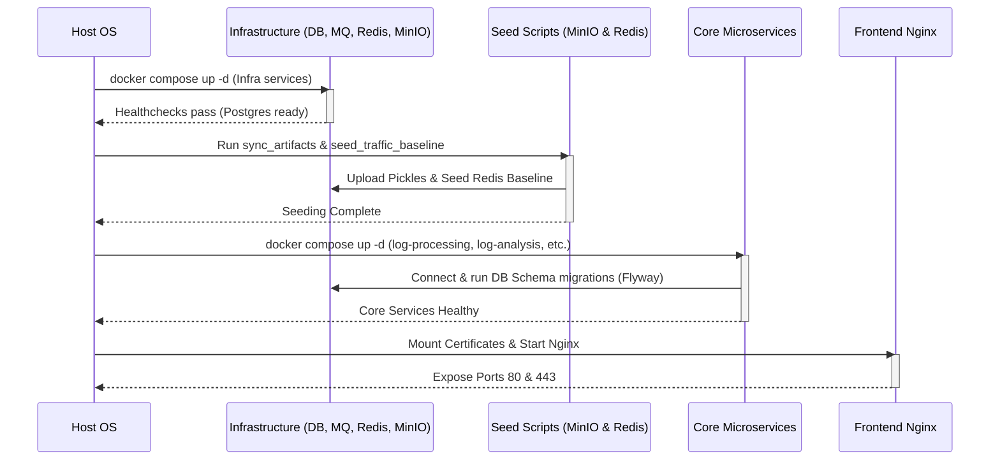

# Deployment and Environment Specification

This document provides the formal technical specification for deploying the **log-analyzer** system. It describes the runtime topologies, environment configurations, containerized networks, routing policies, and lifecycle bootstrap sequences.

---

## 1. Containerized Infrastructure Topology

The log-analyzer system is deployed as a multi-container stack orchestrated via Docker Compose. The runtime environment is divided into two distinct configurations: **Development Mode** (`compose.yml`) and **Deploy Mode** (`compose-deploy.yml`).

### 1.1 Service Catalog & Resource Isolation

| Service Name | Build Image | Runtime Image | Network Namespace | Port Mapping (Host:Container) | Data Persistence / Volumes |
| :--- | :--- | :--- | :--- | :--- | :--- |
| **`rabbitmq`** | — | `rabbitmq:4.2.4-management` | `log-analyzer` | `127.0.0.1:${RABBITMQ_PORT:-5672}:5672`<br>`127.0.0.1:${RABBITMQ_MGMT_PORT:-15672}:15672` | `rabbit-data:/var/lib/rabbitmq` |
| **`postgres-db`** | — | `postgres:17.5` | `log-analyzer` | `127.0.0.1:${POSTGRES_PORT:-5432}:5432` | `db-data:/var/lib/postgresql/data` |
| **`redis`** | — | `redis:7.4` | `log-analyzer` | `127.0.0.1:${REDIS_PORT:-6379}:6379` | `redis-data:/data` |
| **`minio`** | — | `minio/minio:RELEASE.2025-09-07...` | `log-analyzer` | `127.0.0.1:${MINIO_PORT:-9000}:9000`<br>`127.0.0.1:${MINIO_CONSOLE_PORT:-9001}:9001` | `minio-data:/data` |
| **`log-processing`** | `gradle:9.4.1-jdk21-alpine` | `eclipse-temurin:21-jre-alpine` | `log-analyzer` | `127.0.0.1:${APP_PORT:-8080}:8080` | N/A (Ephemeral) |
| **`log-analysis`** | `python:3.12-slim` | `python:3.12-slim` | `log-analyzer` | `127.0.0.1:${DETECTION_PORT:-8000}:8000` | N/A (Ephemeral) |
| **`simulation`** | `python:3.12-slim` | `python:3.12-slim` | `log-analyzer` | `127.0.0.1:${SIMULATION_PORT:-8001}:8001` | N/A (Ephemeral) |
| **`reaction`** | `gradle:9.4.1-jdk21-alpine` | `eclipse-temurin:21-jre-alpine` | `log-analyzer` | `127.0.0.1:${REACTION_PORT:-8082}:8080` | N/A (Ephemeral) |
| **`dashboard`** | `gradle:9.4.1-jdk21-alpine` | `eclipse-temurin:21-jre-alpine` | `log-analyzer` | `127.0.0.1:${DASHBOARD_PORT:-8083}:8080` | N/A (Ephemeral) |
| **`dashboard-fe`** | `node:22` | `nginx:1.27-alpine` (built with `SSL=true`) | `log-analyzer` | `${FRONTEND_HTTP_PORT:-80}:80`<br>`${FRONTEND_PORT:-443}:443` | `/etc/letsencrypt/live/${DOMAIN}/fullchain.pem` and `privkey.pem` mounted read-only as the Nginx TLS cert/key |

*Note: In Deploy Mode, all internal services bind exclusively to localhost (`127.0.0.1`) to ensure network isolation, leaving Nginx (`dashboard-fe`) as the single entrypoint for external clients. All `*_PORT` values and `DOMAIN` are configured via `.env`.*

---

## 2. Nginx Networking & Routing Rules

Nginx serves as the reverse proxy, TLS termination endpoint, and static file server for the dashboard user interface.

### 2.1 Proxy Rules and Endpoints

-   **Frontend Assets (`/`)**: Serves compiled React SPA assets directly from Nginx’s `/usr/share/nginx/html` path. Handles HTML5 router fallbacks by rewriting missing resources to `/index.html`.
-   **Dashboard API (`/api/`)**: Proxies calls directly to `http://dashboard:8080/api/`.
-   **Simulation API (`/simulate/`)**: Proxies controls to `http://simulation:8001/simulate/`.

### 2.2 SSL Termination and SSE Streaming Parameters
Nginx termination redirects all traffic on port `80` to port `443` using a permanent `301` redirect. To accommodate real-time Server-Sent Events (SSE) from the Dashboard service, Nginx disables default buffering policies:

```nginx
location /api/ {
    proxy_pass http://dashboard:8080/api/;
    proxy_http_version 1.1;
    proxy_set_header Host $host;
    proxy_set_header X-Real-IP $remote_addr;
    proxy_set_header X-Forwarded-For $proxy_add_x_forwarded_for;
    
    # Keep SSE stream open
    proxy_set_header Connection '';
    proxy_buffering off;
    proxy_cache off;
    proxy_read_timeout 86400s;
}
```

---

## 3. Configuration & Environment Schema

System configuration is driven by environment variables defined in `.env` at the root of the project.

| Environment Variable | Target Services | Description | Security Classification |
| :--- | :--- | :--- | :--- |
| `POSTGRES_USER` / `POSTGRES_PASS` | `postgres-db`, Spring services | PostgreSQL login credentials. | Confidential |
| `RABBITMQ_USER` / `RABBITMQ_PASS` | `rabbitmq`, all services | RabbitMQ authentication. | Confidential |
| `REDIS_PASS` | `redis`, all services | Requires authentication in Deploy Mode. | Confidential |
| `MINIO_USER` / `MINIO_PASS` | `minio`, `log-analysis`, `simulation` | Root credentials for MinIO storage. | Confidential |
| `ADMIN_API_KEY` | `simulation` | Key for admin-only simulation controls. | Secret |
| `DOMAIN` | `dashboard-fe` (Nginx volumes) | Target domain used to locate the Let's Encrypt certificate at `/etc/letsencrypt/live/${DOMAIN}/`. Required in Deploy Mode — `dashboard-fe` will fail to start if the certificate files are missing. | Public |
| `CORS_ORIGINS` | `dashboard` | Limits cross-origin headers to the dashboard URL. | Public |
| `*_PORT` (`POSTGRES_PORT`, `RABBITMQ_PORT`, `RABBITMQ_MGMT_PORT`, `REDIS_PORT`, `MINIO_PORT`, `MINIO_CONSOLE_PORT`, `APP_PORT`, `DETECTION_PORT`, `SIMULATION_PORT`, `REACTION_PORT`, `DASHBOARD_PORT`, `FRONTEND_PORT`, `FRONTEND_HTTP_PORT`) | All services (`compose-deploy.yml`) | Host port overrides for each service's published port mapping. | Public |
| `MINIO_BUCKET` / `MINIO_SECURE` | `log-analysis`, `simulation` | MinIO bucket name (default `models`) and whether to use TLS against MinIO (default `false`). | Public |

---

## 4. ML Artifact & Storage Seeding Pipeline

The deployment process depends on a pre-boot seeding sequence to populate files and baseline values:

1.  **MinIO Seeding (`sync_artifacts.py`)**:
    -   Executed post-infrastructure bootstrap.
    -   Synchronizes trained XGBoost models (`.pkl` files) and flow schemas from `log-analysis/training/` to the MinIO `models` bucket.
2.  **Redis Seeding (`seed_traffic_baseline.py`)**:
    -   Aggregates historic traffic values to seed baseline records into Redis.
    -   Sets the seasonal statistical parameters required by the Traffic Spike Detection engine (UC1).

---

## 5. Automated Orchestration Script (`run.sh` / `run.ps1`)

The deployment execution is automated via the `run.sh` shell script (accompanied by `run.ps1` for Windows dev environments). The script manages lifecycle orchestration and environment validation:

-   **Modes**:
    -   `dev` (Default): Runs the standard `compose.yml` stack.
    -   `deploy`: Operates the locked-down `compose-deploy.yml` stack, requiring a secure `REDIS_PASS` setting.
-   **Execution Lifecycle**:
    1.  **Validation**: Parses `.env` keys, stripping comments and validating that all required credential fields are defined.
    2.  **Infrastructure Bootstrap**: Executes `docker compose up -d` for `rabbitmq`, `postgres-db`, `redis`, and `minio` only.
    3.  **Liveness Polling**: Runs a health-status loop using `docker inspect` to verify container readiness before proceeding.
    4.  **Seeding**: Launches Python sync runners (`sync_artifacts.py` and `seed_traffic_baseline.py`) using local or virtual environment paths.
    5.  **Application Build**: Rebuilds and launches the primary microservices (`log-processing`, `log-analysis`, `simulation`, `reaction`, `dashboard`, `dashboard-fe`) once dependencies are healthy.

---

## 6. Bootstrap Sequence & Database Migrations



-   **Database Migration Engines**:
    -   **Spring Boot Services**: Use **Flyway** migrations on startup to apply SQL files (`db/migration/*.sql`) under the respective service schema.
    -   **FastAPI Service**: Runs custom Python async migrations on startup to build analysis tables.
-   **Manual Acknowledgment Gate**: Message consumers block acknowledgements until database writes are fully completed, preventing event loss on sudden shutdowns.
