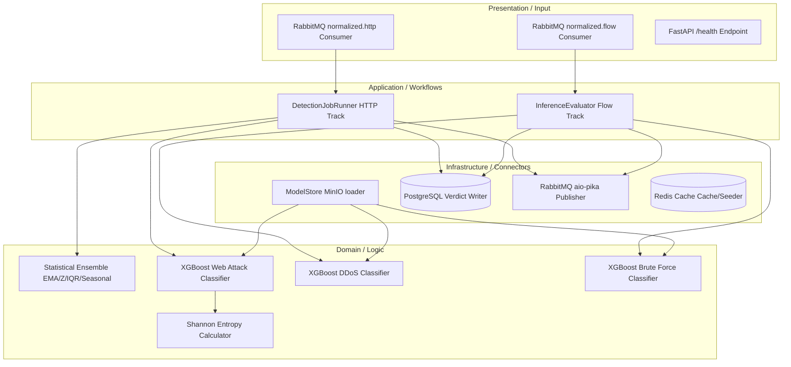

# Detection Service Architecture (Log Analysis)

The **Detection Service** (contained in the `log-analysis` directory) is a FastAPI service responsible for executing behavioral, statistical, and Machine Learning classification models.

---

## 1. Architectural Pattern: Clean Architecture / Hexagonal Architecture

The Detection Service is designed using the **Clean Architecture / Hexagonal Architecture** pattern to isolate mathematical logic and ML models from storage engines and message brokers:

-   **Domain Layer (`domain/`)**: The core domain context. Contains statistical calculators (EMA, Z-score, IQR, Seasonal Baseline), feature engineering formulas (URL Shannon Entropy), and XGBoost inference models. Free of framework, networking, or database constraints.
-   **Application Layer (`application/`)**: Manages coordination workflow, executing inference runs, running scheduled HTTP track evaluation loops, and parsing feature inputs.
-   **Infrastructure Layer (`infrastructure/`)**: Implements outbound ports (PostgreSQL pool client, Redis cache client, RabbitMQ producer script, and MinIO storage sync loaders).
-   **Presentation Layer (`presentation/`)**: Consumes incoming events from `log.normalized.http` and `log.normalized.flow` queues and exposes API health status pages.



---

## 2. Directory Structure

```
log-analysis/
├── server/
│   ├── application/     # Detection job runners and pipeline tasks
│   ├── dependencies/    # DI Container management
│   ├── domain/          # Anomaly models (EMA, IQR, Z-Score, XGBoost classifiers)
│   ├── infrastructure/  # Model store, Redis cache, Postgres connectors, RabbitMQ configs
│   ├── presentation/    # Queue consumers and HTTP health check routers
│   └── main.py          # Service lifespans, ML loading, async setup
└── training/            # Jupyter notebooks for model training pipelines
```

---

## 2. Model Store & Initialization (`infrastructure/model_store.py`)

-   Downloads pre-trained model files (`.pkl` binary files) from the MinIO bucket on startup.
-   Loads binaries into local system memory using `joblib` for high-speed local inference.
-   **Loaded Models**:
    -   `ddos_xgboost.pkl` (UC2 DDoS classifier)
    -   `brute_force_xgboost.pkl` (UC4 Brute Force classifier)
    -   `web_attack_xgboost.pkl` (UC3 Web Attack classifier)

---

## 3. Detection Pipelines

### 3.1 HTTP Analysis Track (UC1, UC3)
-   **UC1 - Traffic Spike Detection**: Executes every 60 seconds. Uses an ensemble of EMA, Z-Score, IQR, and Seasonal Baseline statistical models. Results are aggregated via a weighted-axis voting engine.
-   **UC3 - Web Attack Detection**: Analyzes HTTP requests using a regex matching layer for known signatures, followed by a 12-dimensional XGBoost classification model (calculating URL entropy, structural characteristics, and path depth).

### 3.2 Flow Analysis Track (UC2, UC4)
-   Consumes flow records from `log.normalized.flow`.
-   Executes parallel XGBoost inference processes for DDoS (UC2) and Brute Force (UC4) on a aligned **45-feature vector** (ensuring feature parity).

---

## 4. Communication & Messaging

-   **RabbitMQ Consumer**: Subscribes to `log.normalized.http` and `log.normalized.flow`.
-   **RabbitMQ Publisher**: Publishes alerts to the `detection.results` fanout exchange.
-   **PostgreSQL Write**: Persists every detection verdict to database tables before publishing downstream.
