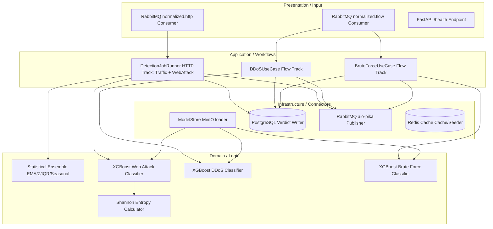

# Detection Service Architecture (Log Analysis)

The **Detection Service** (contained in the `log-analysis` directory) is a FastAPI service responsible for executing behavioral, statistical, and Machine Learning classification models.

---

## 1. Architectural Pattern: Clean Architecture / Hexagonal Architecture

The Detection Service is designed using the **Clean Architecture / Hexagonal Architecture** pattern to isolate mathematical logic and ML models from storage engines and message brokers:

-   **Domain Layer (`domain/`)**: The core domain context. Contains statistical calculators (EMA, Z-score, IQR, Seasonal Baseline), feature engineering formulas (URL Shannon Entropy), and XGBoost inference models. Free of framework, networking, or database constraints.
-   **Application Layer (`application/`)**: Manages coordination workflow, executing inference runs, running scheduled HTTP track evaluation loops, and parsing feature inputs.
-   **Infrastructure Layer (`infrastructure/`)**: Implements outbound ports (PostgreSQL pool client, Redis cache client, RabbitMQ producer script, and MinIO storage sync loaders).
-   **Presentation Layer (`presentation/`)**: Consumes incoming events from `log.normalized.http` and `log.normalized.flow` queues and exposes API health status pages.



---

## 2. Directory Structure

```
log-analysis/
├── server/
│   ├── application/     # Use cases (Traffic/DDoS/BruteForce/WebAttack) and their ports
│   ├── dependencies/    # DI Container management
│   ├── domain/          # Anomaly models (EMA, IQR, Z-Score, XGBoost classifiers)
│   ├── infrastructure/  # Detection job runner, model store, Redis/Postgres/RabbitMQ adapters
│   ├── presentation/    # RabbitMQ consumers (functions, not classes) and FastAPI /health route
│   └── main.py          # Service lifespan, ML loading, async setup
└── training/            # Jupyter notebooks for model training pipelines
```

---

## 3. Model Store & Initialization (`infrastructure/model_store.py`)

-   Downloads pre-trained model files (`.pkl` binary files) from the MinIO bucket on startup.
-   Loads binaries into local system memory using `joblib` for high-speed local inference.
-   **Loaded Models** (object keys under the `models` MinIO bucket, defined in `MODEL_OBJECT_KEYS`):
    -   `flow/ddos/xgboost.pkl` (UC2 DDoS classifier)
    -   `flow/bruteforce/xgboost.pkl` (UC4 Brute Force classifier)
    -   `flow/feature_cols.json` (shared 43-feature column list for UC2/UC4)
    -   `webattack/xgboost.pkl` (UC3 Web Attack classifier)
    -   `webattack/vocab.json` (UC3 parameter-name vocabulary)
    -   `trafficspike/ensemble_calibration.json` (UC1 detector weights/thresholds)
-   A `checksums.json` manifest in the same bucket is fetched first; each `.pkl` is SHA-256-verified against it before `joblib.load()` deserializes it, and any pickle without a matching checksum entry is refused.

---

## 4. Detection Pipelines

### 4.1 HTTP Analysis Track (UC1, UC3)
-   **UC1 - Traffic Spike Detection**: Executes every 60 seconds (`CRON_TRAFFIC`, cron `0 * * * * *`). Uses an ensemble of EMA, Z-Score, IQR, and Seasonal Baseline statistical models. Results are aggregated via a weighted-axis voting engine.
-   **UC3 - Web Attack Detection**: Executes every 5 seconds (`CRON_WEB_ATTACK`, cron `*/5 * * * * *`). Analyzes HTTP requests using a regex matching layer for known signatures, followed by a 12-dimensional XGBoost classification model (calculating URL entropy, structural characteristics, and path depth). Both jobs are scheduled by the same `DetectionJobRunner` against logs accumulated from `log.normalized.http`.

### 4.2 Flow Analysis Track (UC2, UC4)
-   Consumes flow records from `log.normalized.flow`.
-   Executes parallel XGBoost inference processes for DDoS (UC2) and Brute Force (UC4) on a aligned **43-feature vector** (ensuring feature parity).

---

## 5. Communication & Messaging

-   **RabbitMQ Consumer**: Subscribes to `log.normalized.http` and `log.normalized.flow`, both declared via `declare_input_queue()` with `x-dead-letter-exchange`/`x-dead-letter-routing-key` arguments identical to log-processing's (Java) declaration of the same queues — the arguments must match byte-for-byte or RabbitMQ rejects the mismatched re-declare. Processing exceptions are logged with the full message body, then re-raised so `message.process(requeue=False)` rejects the message to its DLQ instead of silently acking it.
-   **RabbitMQ Publisher**: Publishes alerts to the `detection.results` fanout exchange.
-   **PostgreSQL Write**: Persists every detection verdict to database tables before publishing downstream. Web-attack verdicts additionally persist `layer_triggered` (`"rule_engine:<signature>"`, e.g. `"rule_engine:sqli"`, or `"xgboost"`, migration `0002_add_layer_triggered.sql`).
