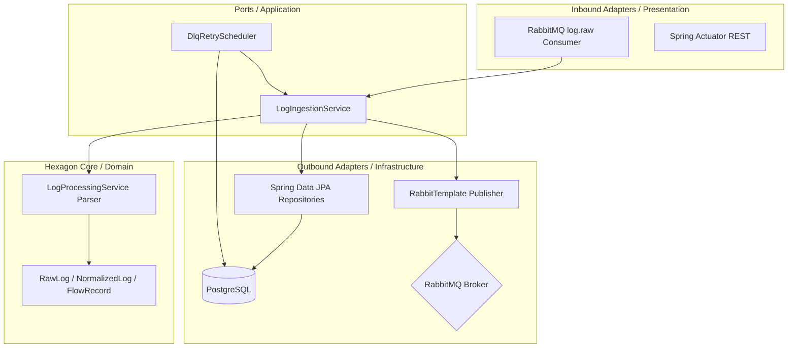

# Log Processing Service Architecture

The **Log Processing Service** is the ingestion gateway of the system. It is responsible for parsing diverse raw log sources, sanitizing incoming values, and distributing them to the detection pipelines.

---

## 1. Architectural Pattern: Hexagonal Architecture (Ports & Adapters)

The Log Processing Service implements a strict **Hexagonal Architecture (Ports and Adapters)** to decouple core log parsing rules from database mechanisms and message brokers:

-   **Domain Layer (`domain/`)**: The core center of the hexagon. Houses domain entities (`RawLog`, `NormalizedLog`, `NormalizedFlowRecord`) and pure log parsing/validation logic. It is framework-free and has zero dependencies on JPA or Spring AMQP.
-   **Application Layer (`application/`)**: Defines the ports and entry points for data flow, orchestrating ingestion processes, DLQ schedulers, and execution steps.
-   **Infrastructure Layer (`infrastructure/`)**: Implements outbound adapters (JPA repositories, Spring AMQP configurations, and Redis drivers) that bind the core application to database backends and brokers.
-   **Presentation Layer (`presentation/`)**: The inbound adapters. Consumes events from the `log.raw` RabbitMQ queue and exposes Actuator/REST endpoints for diagnostics.



---

## 2. Directory Structure

```
log-processing/
├── src/main/java/com/nvh12/log_processing/
│   ├── application/     # DLQ scheduler and ingestion handlers
│   ├── domain/          # Entities (RawLog, NormalizedLog), parsing logic
│   ├── infrastructure/  # Spring AMQP consumers, JPA repositories, Redis config
│   └── presentation/    # REST endpoints, Actuator diagnostics
├── build.gradle         # Gradle dependency build file
└── Dockerfile           # Multi-stage Gradle build setup
```

---

## 2. Core Components & Responsibilities

### 2.1 CLF & Flow Parser (`domain/service/LogProcessingService.java`)
-   **HTTP Parser**: Matches raw messages against CLF patterns. Converts matches into `NormalizedLog` entities containing timestamps, normalized paths, clean query strings, and request details.
-   **Flow Parser**: Unpacks flow record maps. Preprocesses values by executing `Double.isNaN()` and `Double.isInfinite()` checks, replacing invalid floats with `0.0` to preserve vector consistency for downstream ML models.

### 2.2 Ingestion Pipeline & Pipeline Safety
-   Follows the **Persist-then-Publish** pattern.
-   **PostgreSQL Persistence**: Saves incoming raw logs and parsed logs directly to database tables (`normalized_http` and `normalized_flow`) using Spring Data JPA.
-   **RabbitMQ Distribution**: Publishes parsed logs to down-stream queues (`log.normalized.http` and `log.normalized.flow`).

### 2.3 Error Handling & Dual-Path Failure Routing
The service implements two independent error paths to maximize system reliability under different types of failures:
-   **Transient/DB Failures (Redis-backed Retry - `application/DlqRetryScheduler.java`)**: If log processing fails due to transient database or connectivity issues, the transaction rolls back and the raw payload is saved as a `FailedLogEntry` in a Redis list DLQ (key `failed-log-queue`, via `RedisDlqRepository`), and the scheduler retries them periodically with backoff and jitter. Exceeding `maxRetries` (default: 3) persists the entry to the Postgres `drop_audit` table; a failure persisting to `drop_audit` itself re-queues the entry to the Redis DLQ rather than dropping it.
-   **Fatal Parsing/Conversion Failures (RabbitMQ DLX - `presentation/DeadLetterConsumer.java`)**: Fatal payload issues or JSON conversion exceptions cause RabbitMQ to route the rejected message through the Dead Letter Exchange (`log.dlx`) into the `log.raw.dlq` queue. The `DeadLetterConsumer` consumes this queue using a dedicated non-converting factory (`dlqContainerFactory`) and writes the message and its `x-death` metadata directly to the `drop_audit` store.

---

## 3. Technology Stack Configurations

-   **Spring AMQP**: The `log.raw` listener (`RawLogConsumer`) only enqueues into a Redis sorted set; actual processing concurrency comes from a separate `ThreadPoolTaskExecutor` (core: 4, max: 12) driven by `LogProcessingPoller`.
-   **HikariCP Connection Pool**: Maintained at a maximum of 10 connections.
-   **Flyway**: Manages schema generation (`log_processing` schema).
