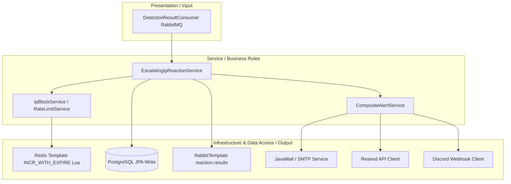

# Reaction Service Architecture

The **Reaction Service** is a Spring Boot service responsible for processing detection verdicts, maintaining escalation states, and executing reactive measures.

---

## 1. Architectural Pattern: Layered Architecture (Three-tier)

The Reaction Service implements a standard **Layered Architecture (Three-tier)** designed to sequentially flow detection verdicts into state evaluations and notification outputs:

-   **Presentation Layer (`presentation/`)**: The entry point. Houses message consumers (`DetectionResultConsumer`) that listen to incoming detection events from RabbitMQ.
-   **Service Layer (`service/`)**: Contains the business logic orchestrating active security policies, IP block decisions, escalation logic, and notification composites.
-   **Data Access / Infrastructure Layer (`infrastructure/` & `config/`)**: Manages external data adapters, providing access to PostgreSQL databases (via Spring Data JPA repositories) and Redis connection handles to execute IP blocks.



---

## 2. Directory Structure

```
reaction/
├── src/main/java/com/nvh12/reaction/
│   ├── config/          # RabbitMQ and Redis bindings
│   ├── infrastructure/  # JPA entities, mail templates, alert dispatchers
│   ├── presentation/    # Log consumers
│   └── service/         # Escalating reaction logic, blocklists, rate limiting
└── Dockerfile           # Gradle builder build setup
```

---

## 2. Core Components & Responsibilities

### 2.1 Escalating IP Reaction Logic (`service/impl/EscalatingIpReactionService.java`)
-   Subclasses: `BruteForceReactionService`, `DDoSReactionService`. `WebAttackReactionService` blocks immediately without escalation (extends `ReactionService` directly).
-   **Whitelist Short-Circuit**: `WhitelistService.isWhitelisted(ip)` is checked first, for every IP-targeted reaction (DDoS, Brute Force, Web Attack — not Traffic, which isn't IP-targeted). The check is an HTTP call to the simulation service's `GET /admin/whitelist` (`infrastructure/service/impl/SimulationWhitelistClient.java`) — reaction holds no whitelist storage of its own and fails open (treats the IP as not whitelisted) if simulation is unreachable. A whitelisted IP skips the attempt counter, the Redis block/rate-limit write, and the alert entirely; only a `WHITELISTED` reaction log is saved for audit. The client caches the fetched set in a single `volatile` immutable snapshot (record `WhitelistCache(ips, expiresAt)`, 5s TTL); reads on a cache hit are lock-free, and only a cache-miss/expiry takes a narrow lock (with a double-check inside) to refresh — avoiding the prior method-level `synchronized` bottleneck under high event volume.
-   **Redis Attempt Counter**: Tracks violation events from source IPs over a 10-minute sliding window using an atomic Redis Lua script (`INCR_WITH_EXPIRE`). The key prefixes (`ddos:attempts:`, `brute:attempts:`) are defined once as shared constants on `EscalatingIpReactionService` and referenced by both subclasses, so `RedisIpBlockService.liftBlock(ip)` can clear every subclass's counter without depending on the subclasses directly.
-   **Escalation Policy**:
    -   `attempts < 3`: Triggers `RATE_LIMIT` action. Updates Redis to throttle traffic.
    -   `attempts >= 3`: Escalates to `BLOCK` action. Blacklists the IP in Redis.
-   **Lifting a block**: `RedisIpBlockService.liftBlock(ip)` removes the block metadata key and set membership, and also clears the IP's `ddos:attempts:`/`brute:attempts:` escalation counters — so a lifted IP starts its escalation count from zero rather than immediately re-escalating on its next violation.
-   **Whitelist Management**: Whitelist storage and the `GET/POST/DELETE/PUT /admin/whitelist` endpoints live in the simulation service (`presentation/routers/access_control_router.py`), gated by `X-Admin-Key`. Reaction does not expose any HTTP endpoints itself (it's a pure consumer/worker service) — writes to the whitelist, and lifting a block, are both done through the **Dashboard** backend (`POST /api/reactions/blocks/lift`, `PUT /api/reactions/whitelist`), which proxies to Simulation's admin API. Reaction only reads the whitelist via the client above, to honor the short-circuit.

### 2.2 Alert Dispatch Engine
-   Implements `CompositeAlertService` to manage notifications.
-   **Supported Channels**:
    -   `smtp`: Standard mail alerts via JavaMail. Active when `alert.provider=smtp` (default).
    -   `resend`: HTTP client dispatching through Resend Email API. Active when `alert.provider=resend`.
    -   `discord`: Sends webhooks containing formatted embed alerts to Discord channels. Active independently whenever `ALERT_DISCORD_WEBHOOK_URL` is set, regardless of `alert.provider` — it is not a third mutually-exclusive provider choice and can run alongside SMTP or Resend.

---

## 3. Communication & Messaging

-   **RabbitMQ Consumer**: Subscribes to the `detection.results` durable queue. Uses **Manual Acknowledgment** (acks are sent only after PostgreSQL and Redis status operations succeed).
-   **RabbitMQ Publisher**: Publishes actions to the `reaction.results` fanout exchange.
-   **PostgreSQL Persistence**: Writes all reaction logs and active block actions to database tables.
