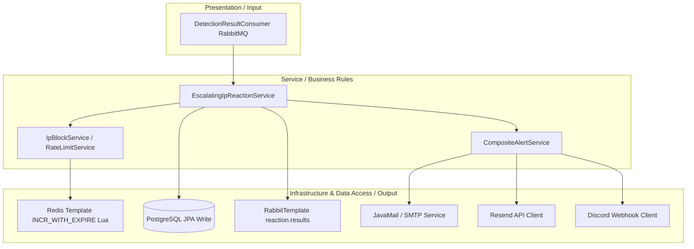

# Reaction Service Architecture

The **Reaction Service** is a Spring Boot service responsible for processing detection verdicts, maintaining escalation states, and executing reactive measures.

---

## 1. Architectural Pattern: Layered Architecture (Three-tier)

The Reaction Service implements a standard **Layered Architecture (Three-tier)** designed to sequentially flow detection verdicts into state evaluations and notification outputs:

-   **Presentation Layer (`presentation/`)**: The entry point. Houses message consumers (`DetectionResultConsumer`) that listen to incoming detection events from RabbitMQ.
-   **Service Layer (`service/`)**: Contains the business logic orchestrating active security policies, IP block decisions, escalation logic, and notification composites.
-   **Data Access / Infrastructure Layer (`infrastructure/` & `config/`)**: Manages external data adapters, providing access to PostgreSQL databases (via Spring Data JPA repositories) and Redis connection handles to execute IP blocks.



---

## 2. Directory Structure

```
reaction/
├── src/main/java/com/nvh12/reaction/
│   ├── config/          # RabbitMQ and Redis bindings
│   ├── infrastructure/  # JPA entities, mail templates, alert dispatchers
│   ├── presentation/    # Log consumers
│   └── service/         # Escalating reaction logic, blocklists, rate limiting
└── Dockerfile           # Gradle builder build setup
```

---

## 2. Core Components & Responsibilities

### 2.1 Escalating IP Reaction Logic (`service/impl/EscalatingIpReactionService.java`)
-   Subclasses: `BruteForceReactionService`, `DDoSReactionService`, `WebAttackReactionService`.
-   **Redis Attempt Counter**: Tracks violation events from source IPs over a 10-minute sliding window using an atomic Redis Lua script (`INCR_WITH_EXPIRE`).
-   **Escalation Policy**:
    -   `attempts < 3`: Triggers `RATE_LIMIT` action. Updates Redis to throttle traffic.
    -   `attempts >= 3`: Escalates to `BLOCK` action. Blacklists the IP in Redis.

### 2.2 Alert Dispatch Engine
-   Implements `CompositeAlertService` to manage notifications.
-   **Supported Channels**:
    -   `smtp`: Standard mail alerts via JavaMail.
    -   `resend`: HTTP client dispatching through Resend Email API.
    -   `discord`: Sends webhooks containing formatted embed alerts to Discord channels.

---

## 3. Communication & Messaging

-   **RabbitMQ Consumer**: Subscribes to the `detection.results` durable queue. Uses **Manual Acknowledgment** (acks are sent only after PostgreSQL and Redis status operations succeed).
-   **RabbitMQ Publisher**: Publishes actions to the `reaction.results` fanout exchange.
-   **PostgreSQL Persistence**: Writes all reaction logs and active block actions to database tables.
