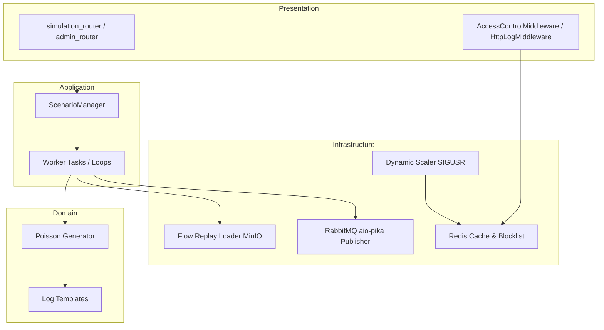

# Simulation Service Architecture

The **Simulation Service** is a Python-based utility that acts as the mock data generator and traffic replayer for the log-analyzer stack. It generates synthetic HTTP log records (normal and attack traffic) and replays historical network flow records.

---

## 1. Architectural Pattern: Clean Architecture / Hexagonal-lite

The Simulation Service is designed using the **Clean Architecture (Hexagonal-lite)** pattern, isolating the core generation logic from framework configurations:

-   **Domain Layer (`domain/`)**: The innermost layer. Contains raw log templates, Poisson calculation algorithms, and scenario configurations. It has no dependencies on HTTP frameworks or brokers.
-   **Application Layer (`application/`)**: Coordinates scenario operations, tracking executing tasks, and handling generator execution flows.
-   **Infrastructure Layer (`infrastructure/`)**: Implements interfaces connecting to external adapters (Redis caching, RabbitMQ publisher scripts, and OS-level Gunicorn scaling wrappers).
-   **Presentation Layer (`presentation/`)**: Handles the HTTP interface via FastAPI controllers. Exposes administrative routers to toggle attacks and normal baselines.



---

## 2. Directory Structure

```
simulation/
├── application/         # Application orchestrators & scenario managers
├── domain/              # Core business rules, scenario models, log templates
├── infrastructure/      # System bindings (Redis client, RabbitMQ, Scaling)
├── presentation/        # FastAPI HTTP Routers & Endpoints
├── Dockerfile           # Docker image setup
├── main.py              # Application lifecycle & lifespan handlers
└── requirements.txt     # Service dependencies
```

---

## 2. Core Components & Responsibilities

### 2.1 Scenario & Traffic Generators
-   **Poisson Traffic Generator**: Simulates normal background traffic patterns using Poisson distribution models to simulate realistic inter-arrival times between benign requests.
-   **Spike/Web Attack Generator**: Generates synthetic malicious HTTP CLF records containing SQLi, XSS, and Path Traversal signatures.
-   **Flow Replay Loader** (`infrastructure/replay_loader.py`): Reads structured network flow records (CICIDS2017 CSV rows) from MinIO on demand for the `/simulate/replay` endpoint — an infrastructure-layer I/O adapter, not domain logic, since it talks directly to the MinIO client.
-   **Distributed Simulation Lock**: A Redis lock (key `{namespace}:lock`, TTL 300s, refreshed every 60s) acquired via `SETNX` prevents concurrent scenario runs across workers. Released in a `finally` block on stop; startup no longer force-clears a stale lock (to avoid a TOCTOU race against a live worker) — `start()`/`replay()` rely solely on the atomic `SETNX` and surface a `RuntimeError` if the lock is already held.

### 2.2 Dynamic Scaling Engine (`infrastructure/scaler.py`)
-   Acts as the execution target for scale actions triggered by the **Reaction Service**.
-   **Process Configuration**:
    -   Reads current worker status from Redis.
    -   Communicates with the Gunicorn parent process using signal traps:
        -   `SIGTTIN`: Spawns an additional Uvicorn worker process (scale up).
        -   `SIGTTOU`: Terminates one Uvicorn worker process (scale down).
    -   Only one worker holds the Redis scaler lock (`scale:scaler_lock`) at a time; others wait and retry each poll interval.

### 2.3 Access Control Middleware (`infrastructure/middleware/access_control.py`)
-   Intercepts simulated target requests.
-   Checks incoming IP against blacklists and rate-limiting counters stored in Redis.
-   Returns `403 Forbidden` for blocked IPs or `429 Too Many Requests` for throttled IPs.

### 2.4 Whitelist Administration (`presentation/routers/access_control_router.py`)
-   Simulation owns the IP whitelist (`whitelist:ips` Redis set) exclusively; no other service writes to this key.
-   Exposes `GET/POST/DELETE/PUT /admin/whitelist`, gated by the `X-Admin-Key` header (`ADMIN_API_KEY`):
    -   `GET` lists the current whitelist; `POST {ip}` / `DELETE {ip}` add/remove a single IP; `PUT [ips]` atomically replaces the whole set (`DEL` + `SADD` in one Redis pipeline).
-   The dashboard-fe frontend calls these endpoints directly through the `/simulate` Vite proxy (not through the dashboard backend).
-   The **Reaction service** has no direct access to this Redis key — it checks whitelist status via an HTTP call to `GET /admin/whitelist` (`SimulationWhitelistClient`), failing open (treats the IP as not whitelisted) if Simulation is unreachable.

---

## 3. Communication & Messaging

-   **RabbitMQ Publisher**: Publishes generated raw log entries to the `log.raw` exchange:
    ```json
    {
      "id": "uuid",
      "source": "HTTP|FLOW",
      "rawMessage": "...",
      "receivedAt": "2025-01-01T00:00:00Z",
      "headers": {}
    }
    ```
-   **Redis Cache**: Shared state storage for:
    -   Dynamic IP blocklists (`blocklist:<ip>`).
    -   Rate limiting buckets.
    -   Current worker count metadata.
