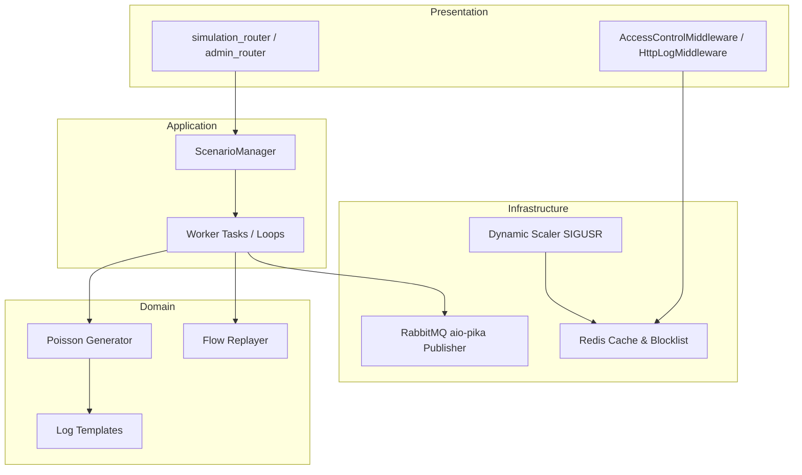

# Simulation Service Architecture

The **Simulation Service** is a Python-based utility that acts as the mock data generator and traffic replayer for the log-analyzer stack. It generates synthetic HTTP log records (normal and attack traffic) and replays historical network flow records.

---

## 1. Architectural Pattern: Clean Architecture / Hexagonal-lite

The Simulation Service is designed using the **Clean Architecture (Hexagonal-lite)** pattern, isolating the core generation logic from framework configurations:

-   **Domain Layer (`domain/`)**: The innermost layer. Contains raw log templates, Poisson calculation algorithms, and scenario configurations. It has no dependencies on HTTP frameworks or brokers.
-   **Application Layer (`application/`)**: Coordinates scenario operations, tracking executing tasks, and handling generator execution flows.
-   **Infrastructure Layer (`infrastructure/`)**: Implements interfaces connecting to external adapters (Redis caching, RabbitMQ publisher scripts, and OS-level Gunicorn scaling wrappers).
-   **Presentation Layer (`presentation/`)**: Handles the HTTP interface via FastAPI controllers. Exposes administrative routers to toggle attacks and normal baselines.



---

## 2. Directory Structure

```
simulation/
├── application/         # Application orchestrators & scenario managers
├── domain/              # Core business rules, scenario models, log templates
├── infrastructure/      # System bindings (Redis client, RabbitMQ, Scaling)
├── presentation/        # FastAPI HTTP Routers & Endpoints
├── Dockerfile           # Docker image setup
├── main.py              # Application lifecycle & lifespan handlers
└── requirements.txt     # Service dependencies
```

---

## 2. Core Components & Responsibilities

### 2.1 Scenario & Traffic Generators
-   **Poisson Traffic Generator**: Simulates normal background traffic patterns using Poisson distribution models to simulate realistic inter-arrival times between benign requests.
-   **Spike/Web Attack Generator**: Generates synthetic malicious HTTP CLF records containing SQLi, XSS, and Path Traversal signatures.
-   **Flow Replayer**: Replays structured network flow records from the CICIDS2017 dataset on scheduled tick intervals.

### 2.2 Dynamic Scaling Engine (`infrastructure/scaler.py`)
-   Acts as the execution target for scale actions triggered by the **Reaction Service**.
-   **Process Configuration**:
    -   Reads current worker status from Redis.
    -   Communicates with the Gunicorn parent process using signal traps:
        -   `SIGUSR1`: Spawns an additional Uvicorn worker process.
        -   `SIGUSR2`: Terminates one Uvicorn worker process.

### 2.3 Access Control Middleware (`infrastructure/middleware/access_control.py`)
-   Intercepts simulated target requests.
-   Checks incoming IP against blacklists and rate-limiting counters stored in Redis.
-   Returns `403 Forbidden` for blocked IPs or `429 Too Many Requests` for throttled IPs.

---

## 3. Communication & Messaging

-   **RabbitMQ Publisher**: Publishes generated raw log entries to the `log.raw` exchange:
    ```json
    {
      "id": "uuid",
      "source": "HTTP|FLOW",
      "raw_message": "...",
      "timestamp": 12345.67
    }
    ```
-   **Redis Cache**: Shared state storage for:
    -   Dynamic IP blocklists (`blocklist:<ip>`).
    -   Rate limiting buckets.
    -   Current worker count metadata.
