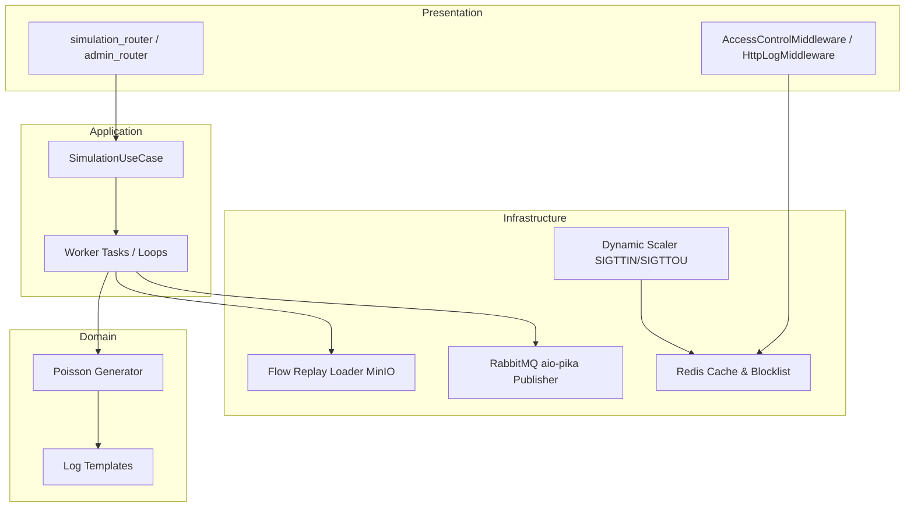

# Simulation Service Architecture

The **Simulation Service** is a Python-based utility that acts as the mock data generator and traffic replayer for the log-analyzer stack. It generates synthetic HTTP log records (normal and attack traffic) and replays historical network flow records.

---

## 1. Architectural Pattern: Clean Architecture / Hexagonal-lite

The Simulation Service is designed using the **Clean Architecture (Hexagonal-lite)** pattern, isolating the core generation logic from framework configurations:

-   **Domain Layer (`domain/`)**: The innermost layer. Contains raw log templates, Poisson calculation algorithms, and scenario configurations. It has no dependencies on HTTP frameworks or brokers.
-   **Application Layer (`application/`)**: Coordinates scenario operations, tracking executing tasks, and handling generator execution flows.
-   **Infrastructure Layer (`infrastructure/`)**: Implements interfaces connecting to external adapters (Redis caching, RabbitMQ publisher scripts, and OS-level Gunicorn scaling wrappers).
-   **Presentation Layer (`presentation/`)**: Handles the HTTP interface via FastAPI controllers. Exposes administrative routers to toggle attacks and normal baselines.



---

## 2. Directory Structure

```
simulation/
├── application/         # Application orchestrators & scenario managers
├── domain/              # Core business rules, scenario models, log templates
├── infrastructure/      # System bindings (Redis client, RabbitMQ, Scaling)
├── presentation/        # FastAPI HTTP Routers & Endpoints
├── dependencies/        # DI container (Container) & admin-key auth dependency
├── Dockerfile           # Docker image setup
├── main.py              # Application lifecycle & lifespan handlers
└── requirements.txt     # Service dependencies
```

---

## 2. Core Components & Responsibilities

### 2.1 Scenario & Traffic Generators
-   **Poisson Traffic Generator**: Simulates normal background traffic patterns using Poisson distribution models to simulate realistic inter-arrival times between benign requests.
-   **Spike/Web Attack Generator**: Generates synthetic malicious HTTP CLF records containing SQLi, XSS, and Path Traversal signatures.
-   **Flow Replay Loader** (`infrastructure/replay_loader.py` — `ReplayLoader`): Reads structured network flow records (CICIDS2017 CSV rows) from MinIO on demand for the `/simulate/replay` endpoint — an infrastructure-layer I/O adapter, not domain logic, since it talks directly to the MinIO client. Drops non-feature columns (`label`, `label_orig`, `attack_type`, `Timestamp`) and coerces non-numeric values to `0.0`.
-   **Flow Stats Loader** (`infrastructure/flow_stats.py` — `FlowStatsLoader`): Loaded once at startup (`main.py` lifespan, only if `MINIO_ACCESS_KEY` is set) from `flow/ddos/class_stats.json` and `flow/bruteforce/class_stats.json` in MinIO. Provides per-class (`benign`/`attack`) feature percentile/sample data that `log_generator._flow_features_from_stats()` uses to synthesize realistic FLOW records; falls back to hand-tuned hardcoded ranges (`_flow_features_hardcoded`) when stats are unavailable.
-   **Distributed Simulation Lock** (`infrastructure/redis_lock.py` — `RedisLock`): A Redis lock (key `{namespace}:lock`, TTL 300s, refreshed every 60s) acquired via `SETNX` (`acquire`) prevents concurrent scenario runs across workers. `start()`/`replay()` rely solely on the atomic `SETNX` and surface a `RuntimeError` if the lock is already held — there is no startup force-clear of a stale lock (that would be a TOCTOU race against a live worker). Refresh and release are ownership-checked via atomic Lua scripts (`refresh_if_owner`, `release_if_owner`) comparing the stored value to the caller's `owner_id` (a per-task UUID) before mutating — a blind `EXPIRE`/`DEL` could otherwise stomp on a different worker that has since acquired the lock after a lapsed TTL. The run loop's `finally` block only calls `release_if_owner` if it still believes it owns the lock; losing the lock (a failed refresh) sets `owner = False` and skips the release instead of deleting the new holder's lock.
-   **Always-on NORMAL Baseline**: `main.py`'s `lifespan` auto-starts a `SimulationUseCase` instance (`Container.baseline_use_case()`, namespace `baseline`) running `SimulationScenario.NORMAL` / `LogType.MIXED` indefinitely (`count=0`) when `AUTO_START_NORMAL=true`. Only one Gunicorn worker process can win the namespaced lock's `SETNX`; the rest catch the resulting `RuntimeError` and skip, so exactly one worker runs the baseline loop. Ownership is tracked in a mutable cell (`owns_baseline = {"value": ...}`, not a plain bool) because it can change after startup — a background `_baseline_watchdog()` task polls every `SCALE_POLL_INTERVAL_SECONDS` and, if no worker currently owns the baseline (e.g. the original owner was reaped by a `SIGTTOU` scale-down), re-attempts `start()` so a surviving worker picks the loop back up within one poll interval. On shutdown, a worker calls `baseline_uc.stop()` (which sets a `stop_signal` key telling the run loop to exit) **only if `owns_baseline["value"]` is `True` for that worker at that moment** — not just at boot; a worker that lost the race at startup, or that never gained ownership via the watchdog, must not stop the baseline, since `stop_signal` is a single global key shared by whichever worker is actually running the loop. After signalling stop, the owning worker polls `baseline_uc.status()` for up to 5s (50 × 100ms) waiting for `state` to leave `"running"`, confirming the loop released its lock before the process exits — this avoids a restart racing the lock's 300s TTL. This fixes a prior bug where every worker fired the global `stop_signal` unconditionally on its own shutdown, letting a non-owning worker's death silently kill the real owner's still-running baseline with no automatic recovery.
-   **NORMAL is not REST-triggerable**: `StartSimulationRequest`'s `scenario` validator rejects `SimulationScenario.NORMAL` outright (`ValueError`), and there is no `/simulate/baseline/stop` route — the only baseline-related route is the read-only `GET /simulate/baseline` (returns `baseline_uc.status()`). The baseline runs for the lifetime of the service; REST callers can only layer attack/anomaly scenarios on top of it via `/simulate/start`.

### 2.2 Dynamic Scaling Engine (`infrastructure/scaler.py`)
-   Acts as the execution target for scale actions triggered by the **Reaction Service**.
-   **Process Configuration**:
    -   Reads current worker status from Redis.
    -   Communicates with the Gunicorn parent process using signal traps:
        -   `SIGTTIN`: Spawns an additional Uvicorn worker process (scale up).
        -   `SIGTTOU`: Terminates one Uvicorn worker process (scale down).
    -   Only one worker holds the Redis scaler lock (`scale:scaler_lock`) at a time; others wait and retry each poll interval.
-   **Logging**: `init()` logs the starting worker count on boot (or the count already running, if a scaler lock from a previous worker is still held). The lock holder logs each scale action twice — once before sending signals (`Scaling up/down: N → M workers`) and once after `scale:current_workers` is updated (`Scaled up/down: now running M workers`) — all at `INFO` level via `main.py`'s `logging.basicConfig()`. Without that `basicConfig` call, the app's own loggers have no handler and fall back to the root logger's WARNING-only default, silently dropping every `INFO` log (only Gunicorn/Uvicorn's own boot logs would appear).

### 2.3 Access Control Middleware (`infrastructure/middleware/access_control.py`)
-   Intercepts simulated target requests.
-   Checks incoming IP against blacklists and rate-limiting counters stored in Redis.
-   Returns `403 Forbidden` for blocked IPs or `429 Too Many Requests` for throttled IPs.

### 2.4 Access Control Administration (`presentation/routers/access_control_router.py`)
All routes below are mounted under `/admin` and gated by the `X-Admin-Key` header (`ADMIN_API_KEY`, via the `require_admin_key` dependency applied to the whole router).
-   **Whitelist**: Simulation owns the IP whitelist (`whitelist:ips` Redis set) exclusively; no other service writes to this key. `GET /admin/whitelist` lists it; `POST/DELETE /admin/whitelist/{ip}` add/remove a single IP; `PUT /admin/whitelist` atomically replaces the whole set (`DEL` + `SADD` in one Redis pipeline).
-   **Blocklist**: `GET /admin/blocklist` lists currently-blocked IPs (`blocklist:ips` enumeration set, each entry's metadata/TTL read from `blocklist:ip:<ip>`, self-healing by pruning the set if the per-IP key already expired); `POST /admin/blocklist/{ip}` blocks an IP for a severity-based TTL (300s/1800s/7200s/86400s for LOW/MEDIUM/HIGH/CRITICAL); `DELETE /admin/blocklist/{ip}` unblocks it.
-   **Rate limit**: `GET /admin/ratelimit` scans `ratelimit:ip:*:limit` keys and reports each IP's rpm/TTL/window-end; `POST /admin/ratelimit/{ip}` sets a severity-based rpm cap (30/10/3/1 for LOW/MEDIUM/HIGH/CRITICAL) with a matching TTL; `DELETE /admin/ratelimit/{ip}` clears all three of that IP's rate-limit keys.
-   **Brute-force tracking**: `GET /admin/brute` lists all tracked IPs' attempt counts (scans `brute:attempts:*`); `GET /admin/brute/{ip}` returns one IP's count (404 if untracked); `DELETE /admin/brute/{ip}` resets it.
-   **`GET /admin/whoami`**: returns the raw `request.client.host` plus its normalized form, so an admin caller behind Docker port-forwarding can find the IP `AccessControlMiddleware` actually sees (which may differ from the IP the client thinks it's connecting from).
-   The dashboard-fe frontend calls whitelist read (`GET /api/reactions/whitelist`) and replace (`PUT /api/reactions/whitelist`) through the **Dashboard backend** (the `/api` axios client in `api.js`). Only simulation control routes — `POST /simulate/start`, `POST /simulate/stop`, `GET /simulate/status`, `POST /simulate/replay`, `GET /simulate/baseline` — go directly through the `/simulate` Vite proxy / nginx location, bypassing the dashboard backend.
-   The **Reaction service** has no direct access to the whitelist Redis key — it checks whitelist status via an HTTP call to `GET /admin/whitelist` (`SimulationWhitelistClient`), failing open (treats the IP as not whitelisted) if Simulation is unreachable.

---

## 3. Communication & Messaging

-   **RabbitMQ Publisher**: Publishes generated raw log entries via the default exchange, routed by the `log.raw` queue name (`RabbitMQPublisherAdapter.publish()` calls `channel.default_exchange.publish(..., routing_key=settings.QUEUE_RAW)`):
    ```json
    {
      "id": "uuid",
      "source": "HTTP|FLOW",
      "rawMessage": "...",
      "receivedAt": "2025-01-01T00:00:00Z",
      "headers": {}
    }
    ```
-   **Redis Cache**: Shared state storage for:
    -   Dynamic IP blocklists (`blocklist:ip:<ip>` per-IP metadata + `blocklist:ips` set for enumeration).
    -   Rate limiting buckets (`ratelimit:ip:<ip>`, `ratelimit:ip:<ip>:limit`, `ratelimit:ip:<ip>:window_end`).
    -   Brute-force attempt tracking (`brute:attempts:<ip>`).
    -   Current worker count metadata (`scale:current_workers`, `scale:replicas`, `scale:scaler_lock`).
